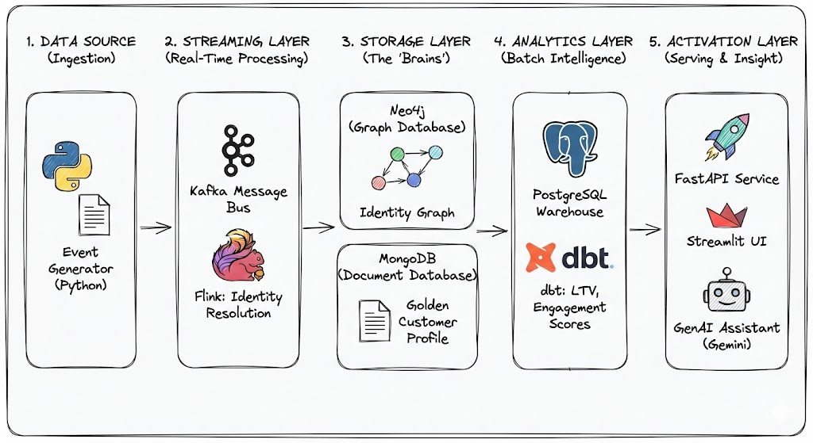
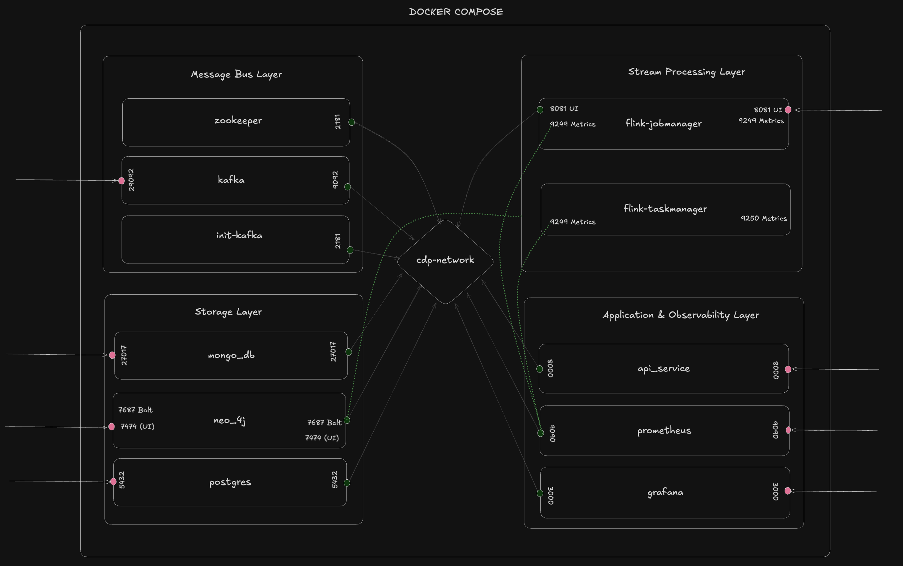
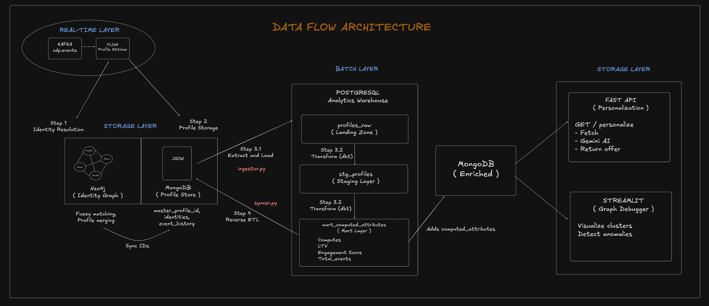

# CDP Prototype with ELT Pipeline & Fuzzy Identity Matching

## Demo
#### Demo:
https://drive.google.com/file/d/1KXuO464gLm-4loAak89OiyyTV28J6xAr/view?usp=sharing

#### Stress Test : 
https://drive.google.com/file/d/1joVy_a9YGhhwKU-NqN49mpYgCsNoyOeY/view?usp=sharing
## Architecture Overview

### Project Overview


### Docker Orchestration 


## Project Structure

```
cdp-prototype/
├── README.md
├── .gitignore
├── .env
│
├── analytics/                   # dbt project for metrics
│   └── cdp_dbt_project/
│       ├── dbt_project.yml
│       ├── packages.yml         
│       ├── models/
│       │   ├── staging/
│       │   │   ├── sources.yml  # PostgreSQL raw tables
│       │   │   └── stg_profiles.sql
│       │   └── marts/
│       │       ├── schema.yml   # Tests & documentation
│       │       └── mart_computed_attributes.sql
│       └── logs/
│
├── docker/
│   └── docker-compose.yml       
│   
├── config/                      # Pydantic configuration
│   ├── __init__.py
│   ├── settings.py              # All environment settings
│   ├── logging_config.py
│   └── constants.py
│
├── frontend/                    # Streamlit graph debugger
│   └── app.py                   # Identity graph visualization
│
├── src/
│   ├── python/
│   │   ├── __init__.py
│   │   │
│   │   ├── common/              # Shared utilities
│   │   │   ├── __init__.py
│   │   │   ├── database.py      
│   │   │   └── models.py        
│   │   │
│   │   ├── producer/            # Event producer : Future - Kafka
│   │   │   ├── __init__.py
│   │   │   ├── main.py
│   │   │   ├── event_generator.py  
│   │   │   └── socket_server.py
│   │   │
│   │   ├── batch/               # ELT Pipeline
│   │   │   ├── __init__.py
│   │   │   ├── main.py          # Orchestrator
│   │   │   ├── ingestor.py      # MongoDB → PostgreSQL
│   │   │   ├── syncer.py        # PostgreSQL → MongoDB (Reverse ETL)
│   │   │   └── scheduler.py     # APScheduler job automation
│   │   │
│   │   └── api/                 # FastAPI server
│   │       ├── __init__.py
│   │       ├── main.py
│   │       ├── routers/
│   │       │   ├── __init__.py
│   │       │   ├── personalization.py
│   │       │   └── graph_router.py      # Graph debugging endpoints
│   │       ├── services/
│   │       │   ├── __init__.py
│   │       │   ├── profile_service.py
│   │       │   ├── ai_service.py        # Gemini integration
│   │       │   └── graph_service.py     # Neo4j graph operations
│   │       └── models/
│   │           ├── __init__.py
│   │           └── schemas.py
│   │
│   └── java/                    # Flink stream processing
│       └── flink-jobs/
│           ├── build.gradle
│           ├── settings.gradle
│           ├── gradlew
│           └── src/
│               ├── main/java/com/cdp/
│               │   ├── config/
│               │   │   └── ConfigManager.java
│               │   ├── models/
│               │   │   └── CustomerEvent.java      # Event parsing
│               │   ├── processors/
│               │   │   └── ProfileStitcher.java    # Identity stitching
│               │   ├── sinks/
│               │   │   ├── MongoSink.java
│               │   │   └── Neo4jSink.java          # Fuzzy matching logic
│               │   ├── sources/
│               │   │   └── EventSource.java
│               │   ├── jobs/
│               │   │   └── CdpStreamingJob.java
│               │   └── utils/
│               │       ├── DatabaseConnector.java
│               │       ├── JsonParser.java
│               │       └── IdentityNormalizer.java # Email/phone normalization
│               └── test/java/com/cdp/
│                   └── utils/
│                       └── IdentityNormalizationTest.java
│
├── tests/
│   ├── __init__.py
│   ├── conftest.py
│   │
│   ├── unit/
│   │   ├── __init__.py
│   │   ├── test_event_generator.py
│   │   └── test_ai_service.py
│   │
│   └── integration/
│       ├── __init__.py
│       ├── test_mongodb_integration.py
│       ├── test_neo4j_integration.py
│       └── test_api_endpoints.py
│
├── scripts/
│   ├── setup.sh                 # Initial setup
│   ├── start_services.sh        # Start Docker services
│   ├── stop_services.sh         # Stop all services
│   ├── run_flink_job.sh         # Submit Flink job
│   ├── run_producer.py          # Event producer CLI
│   ├── run_api.py               # Start FastAPI server
│   ├── run_batch.py             # Run ELT pipeline once
│   ├── run_scheduler.py         # Start scheduled batch jobs
│   ├── simulate_hairball.py     # Test anomaly detection
│   ├── seed_data.sh             # Load test data
│   └── cleanup.sh               # Clean up resources
│
└── docs/
    ├── ARCHITECTURE.md          # System design documentation
    ├── API_DOCUMENTATION.md     # API reference
    └── SETUP.md                 # Installation guide
```

## Data Flow



## Documentation

- **[Architecture](docs/ARCHITECTURE.md)**: System design, data flows, technical decisions
- **[API Documentation](docs/API_DOCUMENTATION.md)**: Endpoint reference, schemas, examples
- **[Setup Guide](docs/SETUP.md)**: Detailed installation and configuration

---

## Service Access Points

| Service | URL/Port | Purpose |
|---------|----------|---------|
| MongoDB | localhost:27017 | Profile database |
| Neo4j Browser | http://localhost:7474 | Graph visualization |
| Neo4j Bolt | localhost:7687 | Database connection |
| PostgreSQL | localhost:5432 | Analytics warehouse |
| Flink Dashboard | http://localhost:8081 | Job monitoring |
| FastAPI Docs | http://localhost:8000/docs | API documentation |
| Streamlit UI | http://localhost:8501 | Graph debugger |

---

## Key Features

### ✅ Identity Resolution
- **Exact matching**: Email, phone, deviceID, userID
- **Fuzzy matching**: APOC text similarity for typos/variations
- **Normalization**: Lowercase, trim, format standardization
- **Multi-identity**: Same customer across devices/channels

### ✅ Profile Unification
- **Real-time stitching**: Flink streams update Neo4j graph
- **Automatic merging**: Shared identities trigger profile consolidation
- **Event history**: Complete audit trail preserved
- **Computed metrics**: Engagement, LTV, product preferences

### ✅ ELT Pipeline
- **SQL-based metrics**: dbt replaces Python calculators
- **Reverse ETL**: Computed metrics sync back to MongoDB
- **Scheduled execution**: APScheduler automation (5-minute intervals)
- **Data quality**: dbt tests validate metric ranges

### ✅ Graph Debugging
- **Visual inspection**: Interactive D3-based graph visualization
- **Anomaly detection**: Hairball pattern identification
- **AI diagnostics**: Gemini classifies cluster types
- **Graph surgery**: Manual split/detach operations
- **Health monitoring**: Real-time anomaly dashboard

### ✅ AI Personalization
- **RAG pattern**: Retrieve profile → Augment context → Generate offer
- **Context-aware**: Uses LTV, engagement, event history
- **Offer types**: Welcome, cross-sell, upsell, loyalty, win-back
- **Reasoning**: Explains recommendation logic

---

## Technology Stack

| Layer | Technology | Purpose |
|-------|------------|---------|
| Stream Processing | Apache Flink 1.18 | Real-time event processing |
| Identity Graph | Neo4j 5.13 + APOC | Fuzzy matching & stitching |
| Profile Store | MongoDB | Unified customer profiles |
| Analytics | PostgreSQL 15 | Metrics warehouse |
| Transformation | dbt 1.7 | SQL-based transformations |
| Batch Jobs | APScheduler 3.10 | ELT automation |
| API | FastAPI | REST endpoints |
| Frontend | Streamlit | Graph debugging UI |
| AI | Google Gemini 1.5 Flash | Personalization & diagnostics |
| Language | Python 3.13 / Java 17 | Runtime environments |

---


