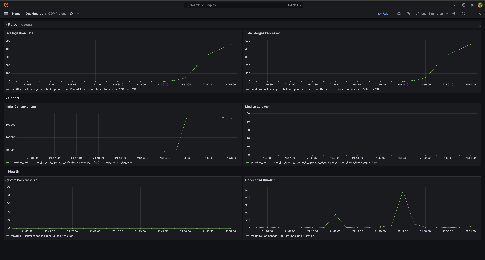

# Grafana Dashboard Guide

Monitor your CDP Streaming Pipeline in real-time with pre-configured Prometheus queries.

---

## Dashboard Panels

### **Pulse** - Real-time Activity

Monitor the heartbeat of your data pipeline.

| Panel Title | Visualization | PromQL Query |
|-------------|---------------|--------------|
| **Live Ingestion Rate** | Time Series (Graph) | `sum(flink_taskmanager_job_task_operator_numRecordsInPerSecond{operator_name=~".*Source.*"})` |
| **Total Merges Processed** | Stat (Big Number) | `sum(flink_taskmanager_job_task_operator_numRecordsOutPerSecond{operator_name=~".*Stitcher.*"})` |

---

### **Speed** - Performance Metrics

Track throughput and latency across your streaming pipeline.

| Panel Title | Visualization | PromQL Query |
|-------------|---------------|--------------|
| **Kafka Consumer Lag** | Time Series | `max(flink_taskmanager_job_task_operator_KafkaSourceReader_KafkaConsumer_records_lag_max)` |
| **Median Latency (p50)** | Time Series | `avg(flink_taskmanager_job_latency_source_id_operator_id_operator_subtask_index_latency{quantile=~"0.50?", job_name="CDP_Streaming_Job"})` |

---

### **Health** - System Stability

Keep an eye on backpressure and checkpoint health.

| Panel Title | Visualization | PromQL Query |
|-------------|---------------|--------------|
| **System Backpressure** | Time Series | `max(flink_taskmanager_job_task_isBackPressured)` |
| **Checkpoint Duration** | Time Series | `max(flink_jobmanager_job_lastCheckpointDuration)` |

---

## Quick Start

1. **Access Grafana**: Navigate to `http://localhost:3000`
2. **Login**: Default credentials - `admin:password123`
3. **Import Dashboard**: Use the queries above to create your panels
4. **Set Refresh**: Configure auto-refresh (e.g., 5s for real-time monitoring)

---

## Query Breakdown

### Pulse Metrics
- **Live Ingestion Rate**: Measures records/second entering the pipeline from Kafka
- **Total Merges Processed**: Counts identity stitching operations completed

### Speed Metrics
- **Kafka Consumer Lag**: Indicates how far behind the consumer is from the producer
- **Median Latency (p50)**: Shows typical processing time for 50% of events
- **Tail Latency (p99)**: Reveals worst-case latency for 1% of events

### Health Metrics
- **System Backpressure**: Value of `1` means operators are overwhelmed (bad)
- **Checkpoint Duration**: Time taken to snapshot state (should be under 1 minute)

## Reference
